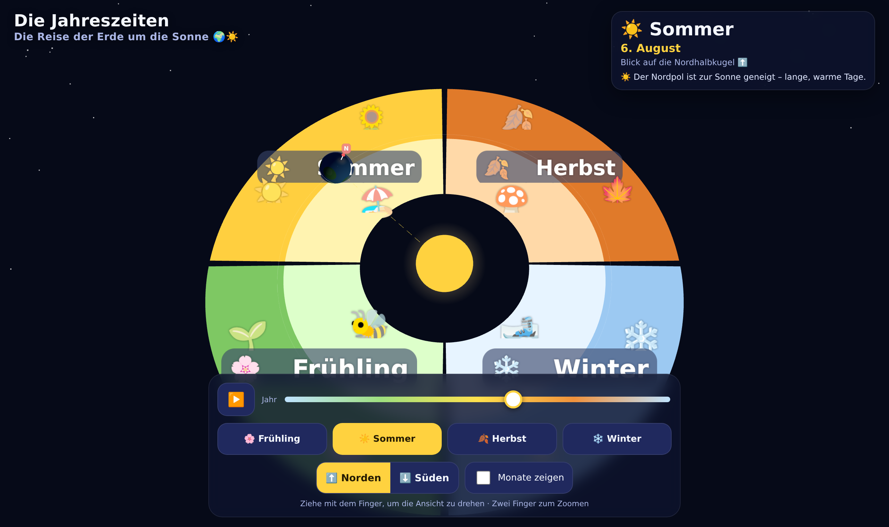

# 🌍 Die Jahreszeiten – Die Reise der Erde um die Sonne

Eine interaktive **3D-Anwendung für Kinder**, die zeigt, wie durch die Reise
der Erde um die Sonne die vier Jahreszeiten entstehen. Läuft komplett im
Browser aus einer einzigen `index.html` – auf **Handy und Desktop**.

👉 **Live:** https://nusability.github.io/jahreszeiten/



## Was man entdecken kann

- **☀️ Umlaufbahn in 3D** – Die Erde umkreist die Sonne. Die Erdachse ist
  fest um **23,5° geneigt**; eine gestrichelte Linie zur Sonne und ein
  kindgerechter Text zeigen, **wie sich der Winkel der Achse zur Sonne**
  über das Jahr verändert (Nordpol zur Sonne = Sommer, weg = Winter).
- **🎨 Reichhaltige Bahnfläche** – Vier farbige Jahreszeiten-Sektoren mit
  typischen Bildern: 🌸 Frühling, ☀️ Sommer, 🍂 Herbst, ❄️ Winter.
- **📅 Monate als Flächen** – Optional lassen sich die 12 Monate als
  Kuchenstück-Segmente mit Namen einblenden.
- **⬆️⬇️ Nord- oder Südhalbkugel** – Umschaltbar (Norden ist Standard). Die
  Kamera wechselt über bzw. unter die Bahnebene, und die Jahreszeiten werden
  passend umbeschriftet (z. B. Juli = Winter auf der Südhalbkugel).
- **▶️ Steuerung** – Die Animation startet am **heutigen Datum**. Mit
  Play/Pause, Jahres-Schieberegler und Schnellwahl-Buttons für jede
  Jahreszeit. Ziehen dreht die Ansicht, zwei Finger zoomen.

## Lokal ausprobieren

Einfach die `index.html` in einem modernen Browser öffnen – oder einen
kleinen Webserver starten:

```bash
python3 -m http.server 8000
# dann http://localhost:8000 öffnen
```

> **Hinweis:** Die 3D-Bibliothek [Three.js](https://threejs.org/) wird beim
> ersten Öffnen einmalig über ein CDN geladen – dafür ist eine
> Internetverbindung nötig. Klappt das nicht, zeigt die App einen Hinweis.

## Technik

- Reines HTML/CSS/JavaScript, **eine Datei**, keine Build-Schritte.
- 3D mit **Three.js** (ES-Module via CDN + Import-Map).
- Responsive Kamera, Touch-Steuerung, deutsche Beschriftung.

## Veröffentlichung

Bei jedem Push wird die Seite automatisch über
[GitHub Actions](.github/workflows/deploy-pages.yml) auf **GitHub Pages**
veröffentlicht.

## Lizenz

[WTFPL](LICENSE) – „Do What The Fuck You Want To Public License". Mach damit,
was du willst. 🎉
